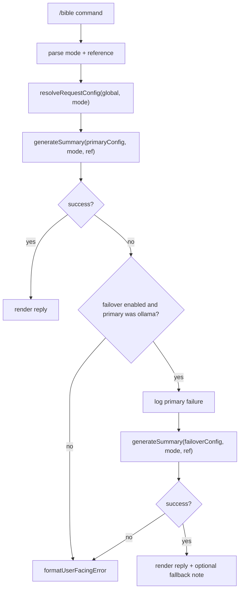

# Per-mode providers and OpenRouter failover (implementation plan)

Tracks [openclaw-extensions#11](https://github.com/kirtquist/openclaw-extensions/issues/11) with Kirt’s target layout: **local Ollama for deep/teaching modes**, **Gemini Flash (3.x) on OpenRouter for brief summaries**, and **OpenRouter Flash as automatic failover** when local Ollama is unreachable.

Status: **planned** — ready to implement on request.

---

## Goals

| Mode | Command examples | Primary backend | Failover |
|------|------------------|-----------------|----------|
| **short** (brief summary) | `/bible --short matthew 5` | OpenRouter **Gemini Flash 3.x** | None (already cloud) |
| **study** | `/bible matthew 5`, `/bible --study …` | Configurable; **default: same as global** (often Ollama) | Optional; same pattern as leader |
| **leader** (teaching / facilitator) | `/bible --leader matthew 5` | **Local Ollama** (e.g. `qwen3.5:27b` on Tailscale Mac) | **OpenRouter Flash 3.x** |
| **enhanced-study** | `/bible --es matthew 5` | **Local Ollama** | **OpenRouter Flash 3.x** |

Non-goals for v1:

- OpenClaw agent model alias resolution (`openrouter/auto`, etc.)
- Study/leader content cache / synchronized questions ([FutureEnhancements.md](./FutureEnhancements.md))
- Web or mobile UI (book/chapter/verse picker + formatted page)—see **Web or mobile app** in [FutureEnhancements.md](./FutureEnhancements.md)
- Failover chains deeper than one hop (Ollama → Flash only)
- Failover for **short** mode (not needed)

---

## Recommended `openclaw.json` (target)

Global defaults = Ollama on the Mac (today’s setup). Mode blocks override only where needed.

```json
{
  "plugins": {
    "entries": {
      "bible-plugin": {
        "enabled": true,
        "config": {
          "provider": "ollama",
          "baseUrl": "http://100.119.77.26:11434/v1/chat/completions",
          "model": "qwen3.5:27b",
          "reasoningEffort": "none",
          "requestTimeoutMs": 300000,
          "signalMaxChars": 1400,
          "defaultMode": "study",
          "openrouterApiKey": "… or use OPENROUTER_API_KEY env on gateway",

          "failover": {
            "provider": "openrouter",
            "baseUrl": "https://openrouter.ai/api/v1/chat/completions",
            "model": "google/gemini-3-flash-preview",
            "requestTimeoutMs": 120000
          },

          "modes": {
            "short": {
              "provider": "openrouter",
              "baseUrl": "https://openrouter.ai/api/v1/chat/completions",
              "model": "google/gemini-3-flash-preview",
              "requestTimeoutMs": 60000
            },
            "leader": {
              "failover": true
            },
            "enhanced-study": {
              "failover": true
            },
            "study": {
              "failover": true
            }
          }
        }
      }
    }
  }
}
```

Notes:

- **Flash model ID** is passed through verbatim to OpenRouter (plugin does not resolve aliases). Use whatever OpenRouter lists today (e.g. `google/gemini-3-flash-preview`; update when 3.x GA id changes).
- `modes.leader.failover: true` means “use global `failover` block when primary fails.” Per-mode `failover` object can override the global failover profile.
- **study** includes failover in the example so group study still works when the Mac is asleep; omit `failover` on study if you prefer hard failure.

---

## Config schema (extend `openclaw.plugin.json`)

1. **`failover`** (optional, top-level): partial endpoint profile — `provider`, `baseUrl`, `model`, `requestTimeoutMs`, optional `reasoningEffort`. Requires `openrouterApiKey` or env when `provider` is `openrouter`.

2. **`modes`** (optional): keys `short` | `study` | `leader` | `enhanced-study`. Each value is a partial override of the top-level profile, plus:
   - **`failover`**: `true` (use global failover), **`false`** (disable), or **object** (mode-specific failover profile).

3. **Merge order** for each request:

   ```text
   base = top-level config (validated)
   effective = { ...base, ...modes[mode] }
   failoverProfile = resolveFailover(effective, global.failover)
   ```

4. **`additionalProperties: false`** on nested objects to match existing schema style.

---

## Runtime flow



### When to attempt failover

Treat primary as failed and retry **once** on failover when **all** of:

- Failover profile is defined and enabled for this mode.
- Primary `provider` was `ollama` (failover is for local-down scenarios; skip if primary was already OpenRouter).

Retry on:

- Network errors (`fetch failed`, `ECONNREFUSED`, `ENOTFOUND`, `ECONNRESET`, etc.)
- Request **timeout** (`AbortError` / `TimeoutError`)
- HTTP **502, 503, 504** from Ollama (if any)

Do **not** retry on:

- **4xx** from Ollama (bad model name, bad request) — user should fix config
- **Invalid JSON** from model — likely model behavior, not “Ollama down”; optional future flag to allow failover on parse errors (default **off**)

Log both attempts:

```text
[bible-plugin] mode=leader primary=ollama failed: …
[bible-plugin] mode=leader failover=openrouter/google/gemini-3-flash-preview …
```

### User-visible fallback hint (optional, recommended)

Append one line when failover succeeded:

```text
(Used OpenRouter fallback — local Ollama was unavailable.)
```

Keep under `signalMaxChars` behavior for **short** mode only on the devotional body; for study/leader, a trailing line is fine.

---

## Code changes (`index.ts`)

| Step | Work |
|------|------|
| 1 | Types + extend `getPluginConfig()` to parse `modes` and `failover`. |
| 2 | `resolveRequestConfig(global, mode)` → effective primary config. |
| 3 | `resolveFailoverConfig(global, modeEffective)` → failover config or `undefined`. |
| 4 | Refactor `generateSummary` caller into `generateSummaryWithOptionalFailover(config, failover, mode, ref)`. |
| 5 | `isFailoverEligibleError(error, primaryProvider)` helper. |
| 6 | Wire command handler; preserve existing temperature / `max_tokens` per mode inside `generateSummary`. |

Optional v1.1 (not required for first PR):

- Per-mode `maxTokens` / `temperature` in config
- Export `resolveRequestConfig` for unit tests (or small `request-config.ts` module)

---

## Tests (`test/request-config.test.mjs` + new cases)

- Merge: no `modes` → unchanged behavior (regression).
- **short** uses OpenRouter model from `modes.short` (mock `fetch`, assert `Authorization` + model id).
- **leader** primary Ollama: first `fetch` throws `ECONNREFUSED`, second succeeds → user text includes content + fallback note.
- **leader** primary 404 → no second call.
- Failover without API key → clear missing-key message after primary fails (or skip failover attempt with log).
- Global `failover` + `modes.leader.failover: false` → no retry.

---

## Documentation updates

- [README.md](./README.md) — “Per-mode providers and failover” with the example JSON above.
- [docs/BIBLE_PLUGIN_TECHNICAL.md](../../docs/BIBLE_PLUGIN_TECHNICAL.md) — merge rules, failover eligibility, logging.
- [updates.md](./updates.md) — changelog when shipped.
- GitHub **#11** — link to this file in a comment when implementation starts.

---

## Rollout

1. Merge after **#10** (informative errors) if not already on `main`.
2. Implement on branch `feat/bible-per-mode-failover`.
3. `npm test` in `extensions/bible-plugin`.
4. Rebuild/install + gateway restart.
5. Smoke tests:
   - `/bible --short john 3` → Flash, fast.
   - `/bible --leader john 3` with Ollama up → local model.
   - Stop Ollama on Mac → same leader command → Flash + fallback note.

---

## Effort

- **Implementation (agent-assisted):** ~1–2 hours wall clock (schema, resolver, failover wrapper, tests, docs).
- **Your time:** review PR, merge, install, ~15 minutes smoke test.

---

## Ready to implement

When you want this built, say **implement #11** (or “go ahead with per-mode failover”). Work order:

1. Branch from latest `main`
2. Code + tests + schema + docs
3. Open PR referencing #11 and this plan

No commit is required for this plan file alone unless you want it on `main` before implementation; it can ride in the feature PR.
